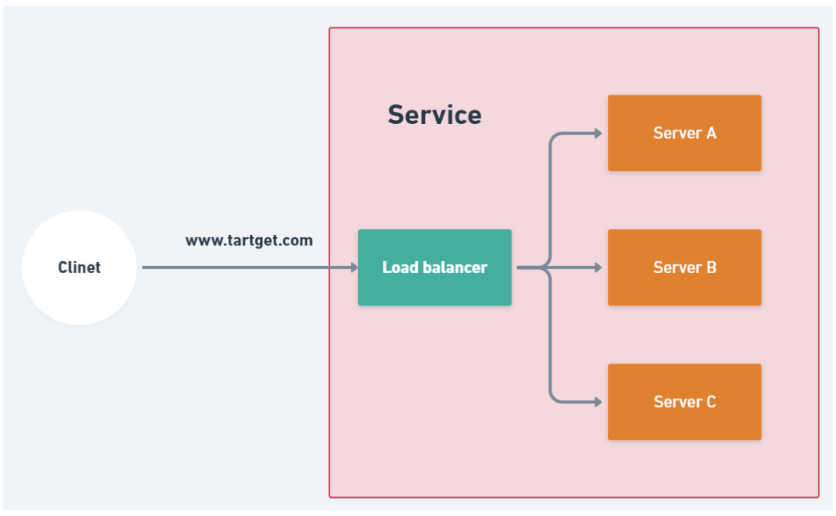

# Load Balancer
### ¿Qué es un balanceador de carga?

Un balanceador de carga es como un enrutador: distribuye eficientemente el tráfico de red entrante y también es un método para resolver problemas de alta concurrencia. En este artículo, usaré Nginx y Docker para crear un balanceador de carga.

### Proxying Http traffic
Para comenzar a usar Nginx para equilibrar la carga del tráfico http, necesitamos definir la directiva upstream y elegir el método de equilibrio de carga.
```
http {
    upstream loadbalancer{
        ${method you want};
        server serverA;
        server serverB;
        server serverC;
    }
    
    server{
        location/ {
            proxy_pass http://loadbalancer;
        }
    }
}
```
1. ```upstream ${name you wanted}``` En esta sección debes definir un nombre de grupo y que esté compuesto por N servidores.
2. ```server {ip of the server}``` Normalmente se necesita escribir la IP del servidor, pero usaremos Docker para compilarlo. Por lo tanto, podemos usar el nombre del archivo docker-compose para sustituir la IP.
3. ```loaction/ proxy_pass http://{group name}``` Para pasar solicitudes a un grupo de servidores, el nombre del grupo se especifica en la directiva proxy_pass.

#### Metodos de load balancing
* **Round Robin**(default) : Las solicitudes se distribuyen de manera uniforme entre los servidores, teniendo en cuenta el peso de los mismos.
* **Least Connections** :  Se envía una solicitud al servidor con el menor número de conexiones activas.
* **Ip Hash** : La solicitud se determina a partir de la dirección IP del cliente, lo que garantiza que la misma dirección obtenga el mismo servidor.
* **Generic Hash** : La solicitud se determina a partir de la clave definida por el usuario.

#### Server weight
Nginx usa el método Round Robin; el peso de cada servidor es 1 por defecto. Sin embargo, puedes configurar el peso como desees.
```
upstream loadbalancer{
    server serverA weight 5;   // A will handle 50% requests
    server serverB weight 3;   // B will handle 30% requests
    server serverC weight 2;   // C will handle 20% requests
}
```
#### Server slow start
Esta función evita que un servidor recientemente recuperado se sature de conexión, lo que podría provocar una nueva falla.
```
upstream loadbalancer{
    server serverA weight 5 slow_start=30s;  
    server serverB weight 3;   
    server serverC weight 2;   
}
```

### Ejemplo
En este ejemplo, usaré FastAPI como framework de backend. Construiré tres servidores y un balanceador de carga con Nginx.
* Estructura
```
Example
├── docker-compose.yml
├── nginx
│   ├── Dockerfile
│   └── nginx.conf
├── servera
│   ├── Dockerfile
│   ├── main.py
│   └── requirements.txt
├── serverb
│   ├── Dockerfile
│   ├── main.py
│   └── requirements.txt
└── serverc
    ├── Dockerfile
    ├── main.py
    └── requirements.txt
```    
* nginx.conf
```
upstream loadbalancer {
    server serverA:8000 weight=1;
    server serverB:8000 weight=1;
    server serverC:8000 weight=1;
}

server {
    location / {
        proxy_pass http://loadbalancer;
    }
}

```
* nginx Dockerfile
```
FROM nginx
RUN rm /etc/nginx/conf.d/default.conf    // remove origin config file
COPY ./nginx.conf /etc/nginx/conf.d/default.conf
```

* docker-compose.yml
```
version: '3'
services:
  servera:
    build: ./servera
    ports:
      - "8001:8000" 

  serverb:
    build: ./serverb
    ports:
      - "8002:8000"   

  serverc:
    build: ./serverc
    ports:
      - "8003:8000" 

  nginx:
    build: ./nginx
    ports:
      - 8080:80
    depends_on:
      - servera
      - serverb
      - serverc
```