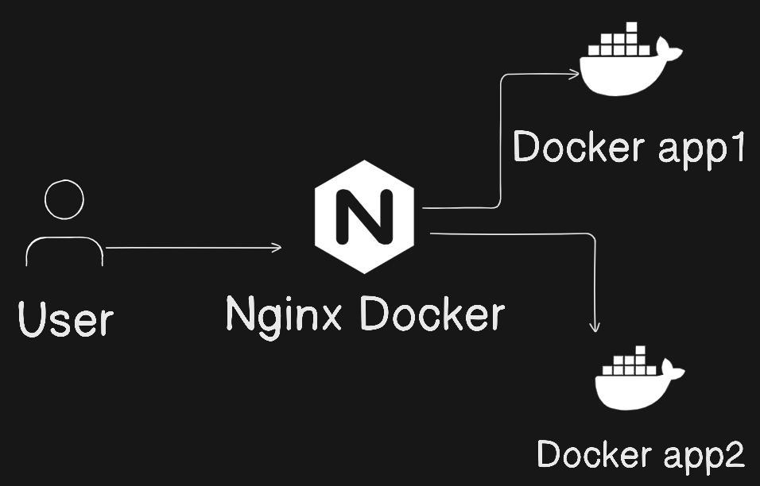

# Reverse Proxy



Este ejemplo se muestra cómo configurar el proxy inverso de Nginx para enrutar solicitudes a diferentes servidores.

Usaremos contenedores Docker para demostrarlo.

Consta de tres servidores Nginx.

## Steps to follow

- Ejecutar docker-compose up

```
docker-compose up
```

- Accede a localhost:8080/

- Esto abre la aplicación principal.

- Accede a localhost:8080/app/

- Recarga la aplicación y se redirige a app1 y app2.


